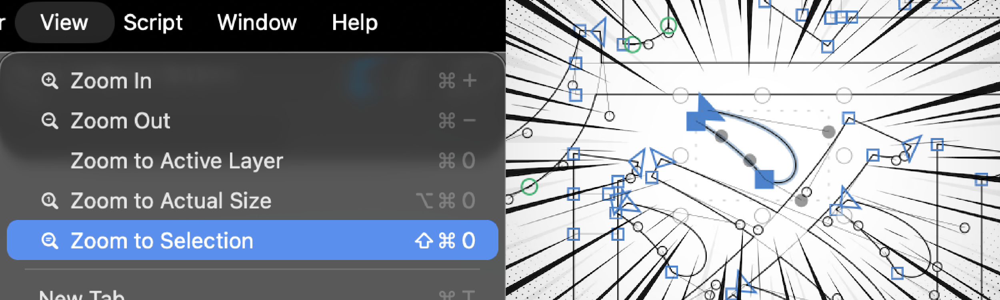

# 拉至選取範圍 | Zoom to Selection

[繁體中文](#繁體中文) | [English](#english)

---

## 繁體中文

這是一個為 [Glyphs 字型編輯軟體](http://glyphsapp.com/) 開發的外掛。它在「顯示」選單中建立一個指令，讓使用者能夠將編輯畫面快速拉近至選取範圍。

### 安裝與使用

1. 從「視窗」選單開啟「外掛程式管理員」
2. 搜尋「拉至選取範圍」並點擊「安裝」按鈕
3. 重新啟動 Glyphs 即可使用
4. 從「顯示」選單選擇「拉至選取範圍」(快捷鍵:`shift-cmd-0`)

### 功能說明

相較於其他書寫系統的設計師，CJK 設計師經常面臨一個獨特的挑戰：一個擁有複雜筆畫的漢字字符可能包含數十個節點或組件。在進行細微調整時，內建的「縮放到圖層」或「縮放到實際大小」功能往往無法提供足夠的視野範圍來觀察細節。

本外掛提供快速拉近至選取範圍的功能，讓 CJK 設計師能夠更高效地專注於細節調整，大幅提升工作流程效率。

### 致謝

感謝 Glyphs 開發團隊提供優秀的字型編輯工具與完善的外掛開發框架。

### 版權聲明

本專案採用 Apache License 2.0 授權。

---

## English

This is a plugin developed for [Glyphs font editing software](http://glyphsapp.com/). It adds an command to the "View" menu that allows users to quickly zoom the editing canvas to the selected range.

### Installation and Usage

1. Open "Plugin Manager" from the "Window" menu
2. Search for "Zoom to Selection" and click the "Install" button
3. Restart Glyphs to use the plugin
4. Select "Zoom to Selection" from the "View" menu (Shortcut: `shift-cmd-0`)

### Features

Compared to designers of other writing systems, CJK designers often face a unique challenge: a single Chinese glyph with complex strokes may contain dozens of nodes or components. When making fine adjustments, the built-in "Zoom to Active Layer" or "Zoom to Actual Size" functions often fail to provide sufficient viewport coverage for observing details.

This plugin provides quick zooming to the selected range, enabling CJK designers to focus more efficiently on detailed adjustments and significantly improving workflow efficiency.

### Acknowledgments

Thanks to the Glyphs development team for providing an excellent font editing tool and comprehensive plugin development framework.

### License

This project is licensed under the Apache License 2.0.
